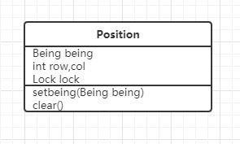

# 报告目录

* 效果展示
* 项目介绍
* 设计思想

## 效果展示

葫芦娃胜利：

回放画面：

(压缩后画面效果有点差)

## 项目介绍

### 玩法

新游戏：设置好葫芦娃阵形和妖怪阵形(菜单栏)之后点击菜单栏开始->新游戏，选择游戏记录的输出文件

回放：可以按"L"也可以点击菜单栏开始->回放，打开并读取游戏记录的输出文件

### 游戏设计

##### 画面介绍：

整个画面分成5部分：**菜单栏、中间主战场、左右两边的状态栏、底部的消息面板**

人物的战斗相关属性有： **血量、攻击力、防御力、移动速度、攻击范围、发射子弹的速度、子弹的移动速度**

左右两边的状态栏显示人物的**剩余血量比例、攻击力、防御力**

底部消息面板播报人物阵亡消息以及游戏提示

##### 人物介绍：

左边是葫芦娃7兄弟(取消了老爷爷)，右边是妖怪和一群小喽啰

两边的人物数量均等，都是7只

人物移动速度、子弹发射速度、子弹移动速度实际上是相应的行为发生后距离下一次该行为发生经过的时间(ms)

为了游戏平衡，人物的某些属性较厉害的同时也能其他属性会弱一点

| 人物名称 | 血量 | 攻击力 | 防御力 | 移动速度 | 攻击范围 | 子弹发射速度 | 子弹移动速度 | 子弹颜色                                 | 解释                                   |
| :------- | :--- | :----- | :----- | -------- | -------- | ------------ | ------------ | ---------------------------------------- | -------------------------------------- |
| 老大     | 200  | 50     | 20     | 1000     | 3        | 500          | 200          | RED               | 老大力大无穷，所以攻击力较高           |
| 老二     | 150  | 30     | 30     | 500      | 10       | 1000         | 800          | ORANGE         | 老二是千里眼顺风耳，攻击范围较大       |
| 老三     | 200  | 20     | 40     | 1000     | 6        | 500          | 500          | YELLOW         | 老三是铜头铁臂，防御力较高             |
| 老四     | 100  | 40     | 20     | 1000     | 4        | 1000         | 500          | GREEN           | 老四能喷火，攻击力较高                 |
| 老五     | 100  | 30     | 30     | 1000     | 8        | 1000         | 800          | CYAN             | 老五能喷水，综合表现一般               |
| 老六     | 100  | 30     | 40     | 1000     | 6        | 1000         | 500          | BLUE             | 老六能隐身不容易被发现，防御力较高     |
| 老七     | 100  | 20     | 30     | 500      | 6        | 500          | 500          | PURPLE         | 老七只有宝葫芦，攻击表现一般，但走得快 |
| 蝎子精   | 300  | 40     | 30     | 1000     | 6        | 800          | 800          | DARKBLUE     | 蝎子精是大BOSS，综合能力较强           |
| 蛇精     | 200  | 30     | 40     | 1000     | 8        | 1000         | 500          | BLACK           | 蛇精的综合能力也较强                   |
| 蜈蚣精   | 200  | 30     | 35     | 1000     | 5        | 1000         | 500          | BROWN           | 作为妖界第三，实力还行                 |
| 蛤蟆精   | 200  | 30     | 25     | 1500     | 5        | 1000         | 1000         | DARKVIOLET | 除了血量，其他属性是来打酱油的         |

##### 战斗过程：

游戏开始后，每个人物寻找附近的敌人，如果不在自己的攻击范围内，则向敌人方向移动，如果在攻击范围内，则向敌人发射子弹。移动的过程带有一定的随机性(试想一下如果敌人在右方，而上方、右方、下方都被己方占领了，如果没有随机性，则人物一直试图向右走，然而是走不通的)。人物受到攻击时，计算血量损失，更新两侧面板的血量。如果小于等于0，则人物死亡，在1000ms内渐渐消失，不留下尸体。两侧状态栏显示人物的灰度图表明人物已死。当其中一方完全死亡时，战场画面被清空，只留下胜利画面和确定按钮。在战斗过程中或者回放过程中，无法选择人物阵形；选择人物阵形之前不能开始新游戏。

##### 伤害计算：

若敌人攻击力>自己防御力:

​	血量 -= (敌人攻击力-自己防御力)

否则根据自己防御力与敌人攻击力的差距梯度减少血量

可以避免死循环的情况(敌人攻击力<=自己防御力&&自己攻击力<=敌人防御力)

### 代码结构

#### 包目录:

* annotation
* being
* formation
* gui
* thread
* test(测试代码)

#### annotation：

​	显然是放注释的，我写了一个Author注释，标明作者

#### being：

​	所有的生物类型、子弹、生物的阵营属性(好与坏)、战斗接口

​	每种生物都有其所属阵营(即Property)，继承自Good类的生物的Property为GOOD，继承自Bad类的生物的Property为BAD。生物能够创建子弹(Creature有一个Bullet的ArrayList存放创建的子弹)，生物能够战斗(Creature实现了Battle接口，实际上Battle接口就是创建子弹)，生物能够移动。

​	每个葫芦娃设计成不同的类，因为不同的葫芦娃的战斗属性不同，并且可以方便以后添加各自独特的技能。

​	UML类图：

​	

#### formation：

​	阵形包，所有的阵形继承自Formation。除了阵形相关的类还有一个Position类，如下所示：

​						

每个Being人手一份全局的Positions(二维，数量为战场格子行数*列数)，因此生物可以观察到各个位置上其他生物的情况，可以移动到其他格子上。多个生物线程争夺位置，必须要对Position的setbeing方法加锁。

#### gui：

​	入口Main类、World类、战场格子Cell类(放置在中间的GridPane面板上)、左右状态栏类、底部消息面板类。Main类初始化整体画面，World类创建生物，并且要根据玩家的行为(新游戏或者回放)来启动不同的线程。

#### thread：

​	这个包是最重要的一个包，生物线程的活动、GUI界面的刷新都由它完成。

​	UML类图：

​	

​	 **BattleThread：**

​			负责创建所有的生物线程，启动定时器，传递用户打开的文件路径给UIFileThread，定时运行

​		UIFileThread，以及当UIFileThread运行完后结束所有线程、关闭资源、初始化所有生物(循环利用生物

​		对象，节约资源)。它自己本身并没有继承Thread或者实现​ Runnable接口。

​	**CreatureThread：**

​			每个生物一个生物线程，将生物对象装入生物线程里。生物线程做决定，指挥生物定位敌人、移

​		动、创建子弹。生物线程并不是FX线程，因此生物线程只负责创建出子弹把子弹放在一个list里，等待UI

​		线程取出子弹创建子弹线程并播放子弹移动动画。

​	**UIFileThread：**

​			继承自Thread，当游戏还没有结束，刷新UI界面(根据生物此时的Position位置将生物图片放置到相

​		应的战场Cell格子上)，更新左右状态栏，更新底部消息面板，当生物死亡时播放消失的动画，取出生物

​		创建的子弹，启动子弹线程并播放子弹运行的动画。当游戏结束时，关闭定时器、调用BattleThread中

​		的结束线程、关闭资源、初始化生物的方法。并且要将整个过程记录在文件中。文件记录格式：txt文

​		件，每一行记录当前所有活着的生物或者刚刚死去的生物的代号、位置、血量、子弹list中的子弹及子弹

​		的目标列，每个生物用空格隔开。如  R:3,4,200,b5 O:5,6,die  表示老大在(3,4)位置，发射了一个子弹(从

​		(3,4)到(3,5))，老二在(5,6)位置刚刚死去。

​			**因为这个线程是由BattleThread启动定时器定时调用的，而非FX线程不	能刷新界面，所以在定时器中UIFileThread并不直接作为任务执行，而是经过其他任务A来执行Platform.runLater(UIFileThread)从而来执行此线程，所以定时器实际是对任务A定时，这就可能造成多线程的不安全问题，所以UIFileThread的run方法里面要加锁。**

​	**BulletThread:**

​			因为子弹的运动是播放javaFX动画，子弹并不占据战场中的Cell，而是直接放置在GridPane面板的

​		相应位置上，所以子弹线程需要每隔一定时间(其所属的生物中的子弹移动速度)计算当前的位置以确定当

​		前位置上是否有敌人从而对敌人造成伤害。

​			**我将子弹的运动设计成动画而不是像生物一样占据Position一格一格地前进(子弹是不占据Position的)，是为了子弹的运动能够更加流畅，而且最重要的问题是如果不是这样那么当子弹前行时碰到障碍(敌人或者友军或者另一个子弹)那么它该怎么办？一个位置只能同时被一个物体占据。**

​	**ReplayThread：**

​			与BattleThread类似，负责启动定时器定时执行ReplayUIThread，结束时关闭资源等。不过不需要

​		创建生物线程。同样它本身没有继承Thread或者实现Runnable接口。

​	**ReplayUIThread：**

​			当输入文件流不为空时，解析每一行生物的状态并更新UI。与UIFileThread一样，run方法里需要加		

​		锁。

#### test:

​	测试包放了测试文件，我创建了一行10个Position，10个除了Position[10]不带其他参数的Being(将Being从abstract class改成 class，以及一个只有Position[]的构造方法，这个构造方法是为了测试而创建的，只用于测试不能用于程序主体)，让10个Being在(0,10)之间随机选择一个数index，占位Position[index]，如果没能成功占位则位置设置为-1。最后输出成功占位的生物所在的位置是否有相同的。

## 设计思想

#### 封装：

​	大多数的属性都是包可见的，不能直接被包外的类访问，向外界提供获取方法。

​	生物线程不直接将生物移动位置，而是调用生物的moveto()等方法指挥生物

#### 继承：

​	所有生物继承自Creature，Creature又继承自Being。Creature又被其他类继承。而Creature类和Being类实现了所有通用方法，代码复用程度高。

​	所有阵形继承自Formation。

#### 多态：

​	Formation申明了设置阵形的方法，设置不同的阵形调用各自不同的设置方法。

#### 异常处理：

​	创建文件流、线程睡眠。

#### 集合：

​	主要是ArrayList，很多地方都用到了，例如生物将创建好的子弹放在ArrayList中。

#### 泛型：

​	Cell中可以放置的物体、Position中放置的物体采用了泛型 \<T extends Being\>。

#### 注解：

​	每个包中主要的类添加了Author注解。